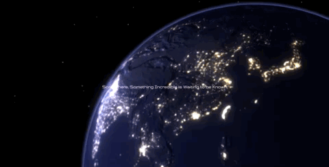

<div align="center" id="top"> 
  

  &#xa0;

  <a href="https://cynthia-3d-space.netlify.app/">Demo</a>
</div>

<h1 align="center">3D Space</h1>

<p align="center">
  

  

  

  

  <!--  -->

  <!--  -->

  <!--  -->
</p>

<!-- Status -->

<!-- <h4 align="center"> 
	🚧  3d Space 🚀 Under construction...  🚧
</h4> 

<hr> -->

<p align="center">
  <a href="#dart-about">About</a> &#xa0; | &#xa0; 
  <a href="#sparkles-features">Features</a> &#xa0; | &#xa0;
  <a href="#rocket-technologies">Technologies</a> &#xa0; | &#xa0;
  <a href="#white_check_mark-requirements">Requirements</a> &#xa0; | &#xa0;
  <a href="#checkered_flag-starting">Starting</a> &#xa0; | &#xa0;
  <a href="#memo-license">License</a> &#xa0; | &#xa0;
  <a href="https://github.com/{{YOUR_GITHUB_USERNAME}}" target="_blank">Author</a>
</p>

<br>

## :dart: About ##

An interactive, 3D rendering of space at night with Earth, the Sun, the Moon, stars and an astronaut laid out to show the vastness of space. This application uses ThreeJS for realistic 3D rendering, GSAP for smooth scroll triggered animations and text, 3D model animations, postprocessing techniques including ThreeJS layers, UnrealBloom for city lights and the sun, OutlinePass for Earth's atmosphere.

View the site live at: https://cynthia-3d-space.netlify.app/




## :sparkles: Features ##

:heavy_check_mark: Smooth GSAP scroll triggered animations and text;\
:heavy_check_mark: 3D web technology using ThreeJS for realistic planet modelling with bump and texture maps;\
:heavy_check_mark: 3D model animations;\
:heavy_check_mark: Postprocessing scene effects including camera layers, flickering city lights, and Earth's atmosphere;\
:heavy_check_mark: Dazzling rendering of the Sun using Lensflare technique;\
:heavy_check_mark: Interactive mouse movement of the stars;

## :rocket: Technologies ##

The following tools were used in this project:

- [ThreeJS](https://threejs.org/)
- [Node.js](https://nodejs.org/en/)
- [React](https://pt-br.reactjs.org/)
- [GSAP](https://greensock.com/gsap/)

## :white_check_mark: Requirements ##

Before starting :checkered_flag:, you need to have [Git](https://git-scm.com) and [Node](https://nodejs.org/en/) installed.

## :checkered_flag: Starting ##

```bash
# Clone this project
$ git clone https://github.com/cynthiachiu/3D-Space

# Access
$ cd 3D-Space

# Install dependencies
$ npm install

# Run the project
$ npm start

# The server will initialize in the <http://localhost:3000>
```

## :memo: License ##

This project is under license from MIT. For more details, see the [LICENSE](LICENSE.md) file.


Made with :heart: by <a href="https://github.com/cynthiachiu" target="_blank">cynthiachiu</a>

&#xa0;

<a href="#top">Back to top</a>
